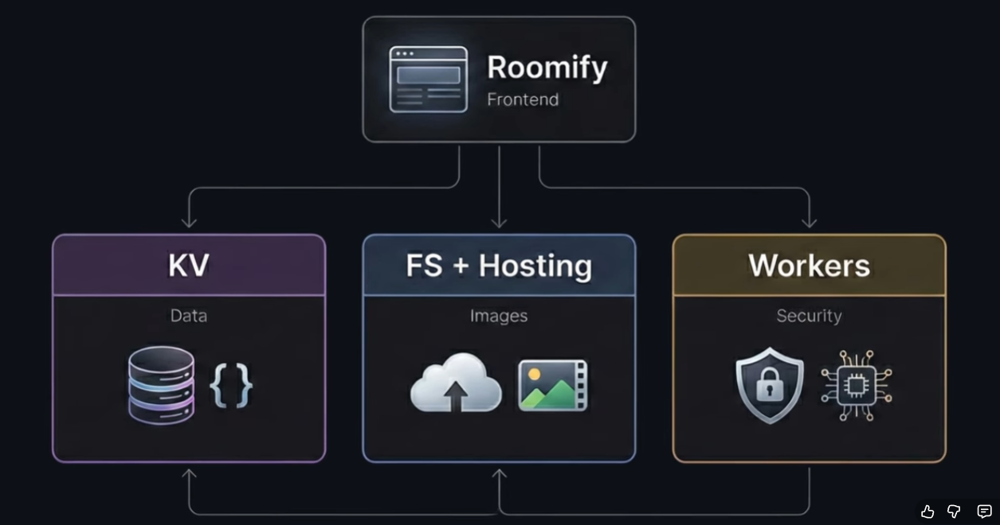

### Setup
1. Create project
2. Add React
3. Use React Router v7

## puter.com

### Puter User-Pays Model: Key Benefits
- No infra costs for devs (users pay for their own cloud, AI, APIs)
- Scales from 1 to 1M users, same cost
- No server, DB, or billing management
- Users manage their own usage
- Powerful features, no backend cost worries
- No scaling or spike concerns for devs

## Installed UI Packages
- `npm install lucide-react`
- `npm install tw-animate-css`
- Copied global CSS from kit

## UI
- Designed button and basic UI components

# Authentication
- install puter js (https://docs.puter.com/getting-started/)
- Now very imp Create lib in root and then puter.actions.ts
- took help of useOutletContext  to implement DEFAULT_AUTH_STATE: in app/root.tsx
``
useOutletContext in React Router lets you access data or functions that a parent route passes down to its nested child routes.
It’s useful when you want child components to share or use context provided by their parent route, without using React’s global context or props.
``

# Homepage design done 
# Upload-files branch started to , implement upload feature 

# hosting-images and structure 

https://youtu.be/JiwTGGGIhDs?t=4453

# Question Section 

### Q1. type and interface difference ?
answer : in 2 line only 
Link : https://www.youtube.com/shorts/J9r35KJMqzI?feature=share

# do check out usefull comments easter i left in the entier code 
